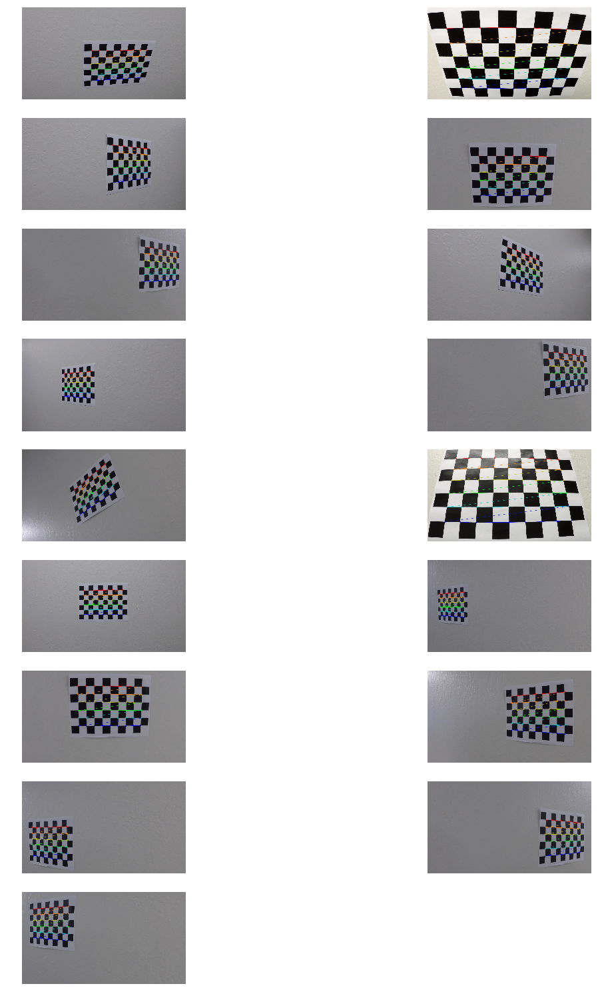
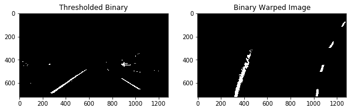
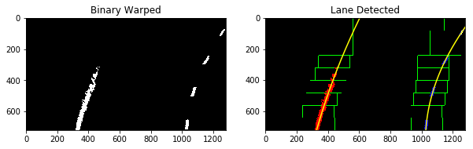
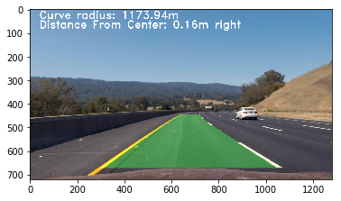

## Advanced Lane Finding

The Steps
---

The steps of this project are listed below. You can have a look at [AdvancedLaneDetection.ipynb](AdvancedLaneDetection.ipynb) for the code.

1) Distortion Correction

The images for camera calibration are stored in the folder called `camera_cal`. I compute the camera matrix and distortion co-efficients to undistort the image.

2) Gradients and color thresholds.
I applied thresholds on gradients and colors to obtain a binary thresholded image.

###Perspective transform ("birds-eye view").
I extracted the vertices to perform a perspective transform and the polygon with these vertices is drawn on the image 

3) Detect lane pixels (sliding window search).
I then perform a sliding window search.

4) Example Result
Warp the detected lane boundaries back onto the original image

The Video
---
The pipeline is applied to a video. 

[

Discussion
---

The code does not perform well on challenge videos due to varied illumination color shades in challenge videos. For further research I plan to refine my pipeline to work in more varied environments and nomralization of the image.

References:

1) More robust lane finding using advanced computer vision techniques https://chatbotslife.com/robust-lane-finding-using-advanced-computer-vision-techniques-46875bb3c8aa

2) Camera calibration With OpenCV: https://docs.opencv.org/2.4/doc/tutorials/calib3d/camera_calibration/camera_calibration.html

3) Radius curvature: http://www.intmath.com/applications-differentiation/8-radius-curvature.php

4) https://github.com/Nallo/CarND-P4-Advanced-Lane-Lines

5) https://medium.com/@ajsmilutin/advanced-lane-finding-5d0be4072514

